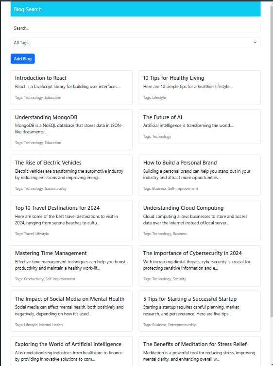
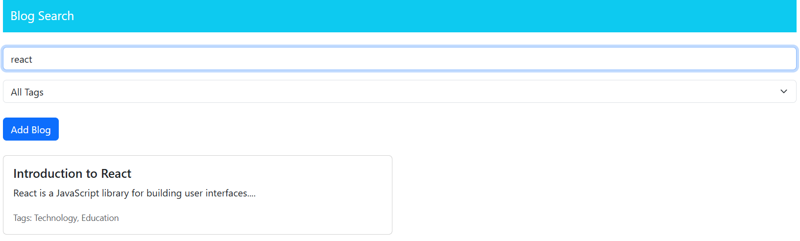
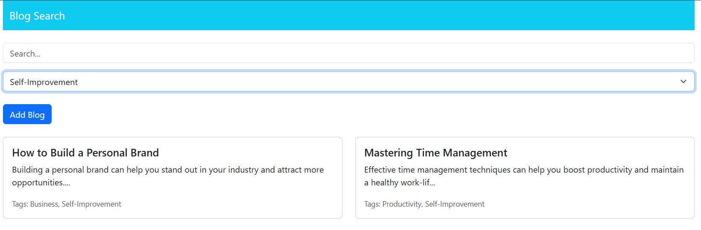
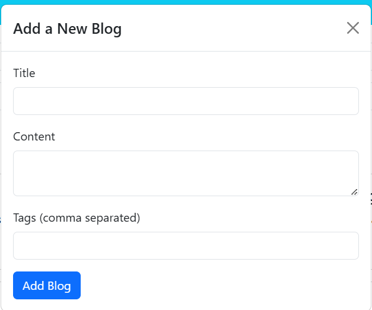
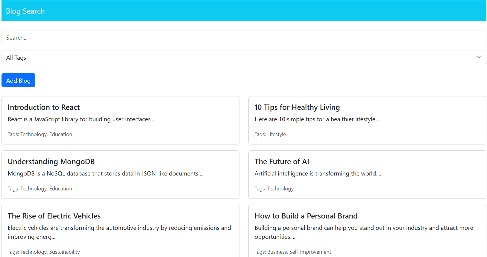

# BlogSite 📝
Welcome to **BlogSite**, a modern blogging platform built with the **MERN stack** (MongoDB, Express.js, React.js, Node.js). This project allows users to create, edit, delete, and explore blog posts with ease. It also features secure authentication and a sleek, responsive design.

---

## 🚀 Features
- User-friendly interface for creating and managing blog posts.
- Secure user authentication using JWT.
- Search and filter functionality for blog posts.
- Rich text editor for crafting blog content.
- Fully responsive design for all devices.

---

## 📸 Screenshots
Here are some key screenshots of the application:

### Mobile-Friendly Design


### Search Blog


### Filter Blogs by Tags


### Add a New Blog


### Home Page


---

## 💻 Installation

### Prerequisites
- Node.js installed
- MongoDB running locally or a connection string to a remote MongoDB server

### Steps
1. Clone the repository:
   ```bash
   git clone https://github.com/your-username/blogsite.git


2. Navigate to the project directory:
  cd blogsite
  Install dependencies:


3. Install frontend dependencies
  cd frontend
  npm install

4. Install backend dependencies
  cd ../backend
  npm install

5. Set up environment variables:
  Create a .env file in the backend directory and add the following:
  MONGO_URI=your_mongo_db_connection_string
  JWT_SECRET=your_secret_key

6. Start the development server:
   Start backend
  cd backend
  npm run dev

  Start frontend
  cd ../frontend
  npm start
  Open the application in your browser at http://localhost:3000.

🤝 Contributions
Contributions are welcome! Feel free to fork the repository and submit pull requests.
